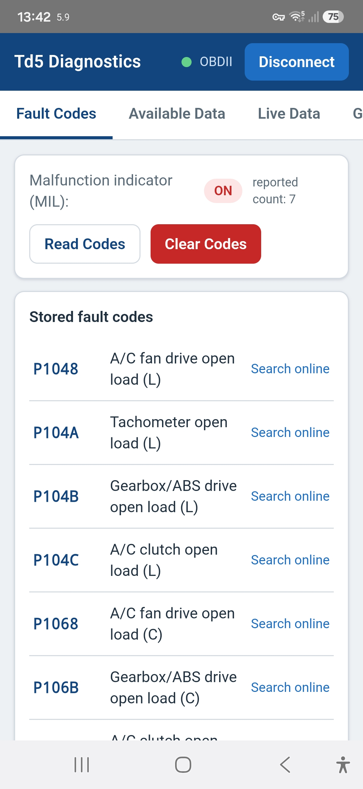
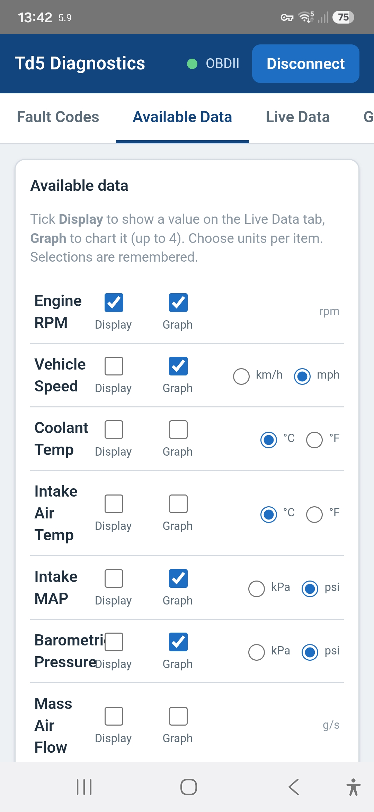
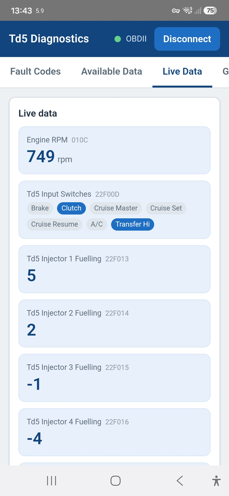
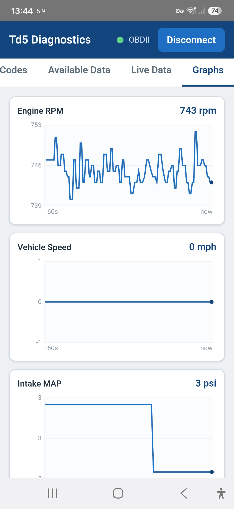

# Td5-Diagnostic-App

An open-source OBD2 scanner for Land Rover Td5 vehicles - live data, fault codes, and the parameters unique to the Td5, at a fraction of the cost of a NanoCom. Compatible with ELM327 apps, with its own built-in web app and an Android app.

An OBD2 scanner has become an essential part of most vehicle owners' toolkit. However, if you own a Land Rover Td5, your options are limited and expensive.

NanoCom from BlackBox Solutions is the go-to for most people, but it's pricey. If you want to re-map your engine it's good value - but most people just want to read live data and read/clear Diagnostic Trouble Codes (DTCs). On any other vehicle a simple ELM327 scanner and a phone app cost next to nothing; Td5 owners have had to fork out £600+ for a NanoCom. This project is a low-cost alternative - one you can leave in the Land Rover without worrying that it'll get wet, damaged or stolen.

Along with the matching hardware (a K-Line interface + ESP32-S3), it plugs into the Td5 diagnostic socket and emulates an ELM327 scanner. Unlike generic OBD2 apps, the app here also shows the information unique to the Td5, and reads and clears DTCs - completely free and open source.

## Connecting to the Dongle

The dongle hosts the whole app itself, so the main way to use it is to open a web page it serves over its own WiFi - there's nothing to install.

### The main way - web page over WiFi (works on everything)

1. Connect your phone, tablet or PC to the open WiFi network **`OBDII`** (no password).
2. Open a browser and go to **http://11.1.1.1**.

That's it - the app loads straight from the dongle and connects itself. No app to install, no Bluetooth pairing. This works the same on **iPhone, iPad, Android and PC**.

> While you're on the dongle's WiFi your device has no internet, so online fault-code look-ups won't work. On Android you can connect over Bluetooth instead (see below) to keep your internet.

### iPhone and iPad

The WiFi web page above is the **only** way to connect on an iPhone or iPad - Safari can't use Bluetooth. Just join **`OBDII`** and open **http://11.1.1.1**; Safari handles it perfectly.

### Android - WiFi or the app

On Android you have two options:

- **Web page over WiFi** - exactly as above: join **`OBDII`** and open **http://11.1.1.1**. Nothing to install.
- **The Android app over Bluetooth** - install the [APK](Td5-Diagnostics-debug.apk) (see *Installing the Android App* below), open it, tap **Connect** and choose **OBDII**. Because this connects over Bluetooth, your phone stays on its normal mobile data, so online DTC look-ups keep working.

> The dongle serves **one connection at a time** - whichever you connect with first (WiFi or Bluetooth) is used for that session, and the other is disabled until the dongle restarts (which it does each time the engine starts).

## Installing the Android App

The app isn't on the Google Play Store yet - I'll upload it there in due course to make installing and updating easy. In the meantime you can "side-load" it directly, which only takes a minute:

1. On your Android phone or tablet, download [**Td5-Diagnostics-debug.apk**](Td5-Diagnostics-debug.apk) from this repository (open the link, then tap the download button).
2. Open it from your Downloads. Android will warn you it's from an "unknown source" - this is normal for any app installed outside the Play Store.
3. Follow the prompt to Settings and allow "Install unknown apps" for your browser (or Files app), then go back and tap Install.
4. Open Td5 Diagnostics, tap **Connect**, and choose **OBDII** from the list.

Because this is a debug build it isn't signed for the Play Store, so that "unknown source" warning is expected and safe to accept. Once the Play Store version is live I'll link to it from here (Google can take a while to approve an app).

## What the App Does

There are four simple tabs - swipe left and right to move between them:

- **Fault Codes** - read and clear DTCs, each with a plain-English description of the Td5 fault and a link to look it up online. Once connected it also shows the vehicle's VIN and current fuel-map name (where the ECU provides them).
- **Available Data** - every parameter the ECU will give you, including the extras unique to the Td5 - injector balance, accelerator tracks, EGR and wastegate, glow-plug and relay states, sensor voltages, idle-speed error and more - plus calculated values like turbo boost and live fuel economy (instantaneous, a rolling 10-mile average, and trip fuel used). Tick what you'd like to see and/or graph, and pick your units.
- **Live Data** - your chosen parameters, updating live.
- **Graphs** - up to four auto-scaling charts so you can watch how things move (boost, temperatures, injector balance and so on).

### Logging

On the **Available Data** tab there's a single **Log displayed items to CSV** tick box. Tick it and everything you've chosen to display is written to a timestamped CSV file, in your selected units - handy for looking at a fault after a drive, or comparing readings over time.

- **In the Android app**, the file is saved straight to the phone's **Documents** folder as `Td5_Log_<date>_<time>.csv` (open it with the Files app, or copy it off over USB).
- **In the web page**, tick to start, then use **Download log now** - or simply untick - to save the file to your browser's Downloads.

## Screenshots

| Fault Codes | Available Data |
|:-----------:|:--------------:|
|  |  |
| **Live Data** | **Graphs** |
|  |  |

## What's in this Repository

| Item | Contents |
|--------|----------|
| `Firmware/` | The ESP32-S3 dongle firmware (Arduino). It turns the K-Line interface into an ELM327 that apps can talk to over **Bluetooth**, and also hosts the web app over **WiFi** (open `OBDII` network, http://11.1.1.1). |
| `App/` | The Android app project (built with Capacitor) used to produce the APK. |
| `Hardware/` | The complete dongle design: PCB gerbers, schematic, BOM, pick-and-place, Altium source, and 3D-printable case halves. |
| [`Td5-Diagnostics-debug.apk`](Td5-Diagnostics-debug.apk) | The ready-to-install Android app. |

## The Hardware

The dongle is an ESP32-S3 plus a simple K-Line interface (an L9637D transceiver and a little protection circuitry). It connects to the Td5 diagnostic line - OBD pin 7, or pin B18 on the ECU. Everything needed to build one is in the [`Hardware`](Hardware) folder:

- **PCB** - send [`Td5_OBD2_Gerber.zip`](Hardware/Td5_OBD2_Gerber.zip) to any board house to have the board made.
- **Assembly** - [`Td5_OBD2_BOM.csv`](Hardware/Td5_OBD2_BOM.csv) (bill of materials) and [`Td5_OBD2_PickAndPlace.xlsx`](Hardware/Td5_OBD2_PickAndPlace.xlsx).
- **Design source** - the full [schematic (PDF)](Hardware/Td5_OBD2_Schematic.pdf) and the editable [Altium project](Hardware/Td5_OBD2_Altium.zip).
- **Enclosure** - two 3D-printable case halves: [left](Hardware/Dongle%203D%20Print%20Shell%20Left.STEP) and [right](Hardware/Dongle%203D%20Print%20Shell%20Right.STEP) (STEP).

## Building From Source

**Firmware:** open `Firmware/Td5_Diagnostic/Td5_Diagnostic.ino` in the Arduino IDE, select the **XIAO_ESP32S3** board and upload. You'll need the *EspSoftwareSerial* and *NimBLE-Arduino* libraries (WiFi and DNSServer are built into the ESP32 core). The web app the dongle serves over WiFi is embedded as `webapp_html.h`, already in the repo, so it builds as-is. If you change the app, regenerate that header with `python Firmware/tools/embed_webapp.py` before rebuilding.

**Android app:** the app is `App/www/index.html` plus a small Bluetooth bridge that lets the native APK reach the phone's Bluetooth stack (an Android WebView has no Web Bluetooth). To rebuild the APK, run `npm install` in the `App` folder, then `npm run sync`, and build with Android Studio (or `gradlew assembleDebug`).
